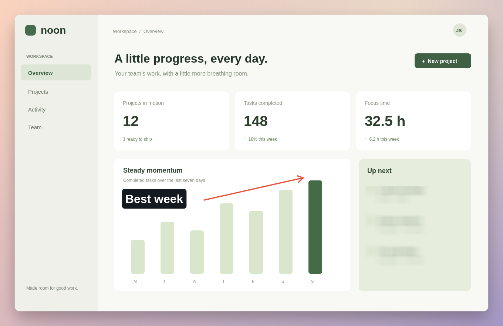
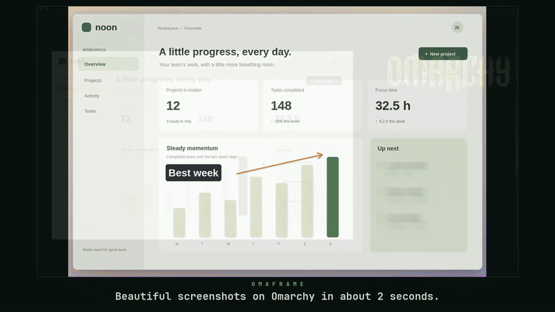
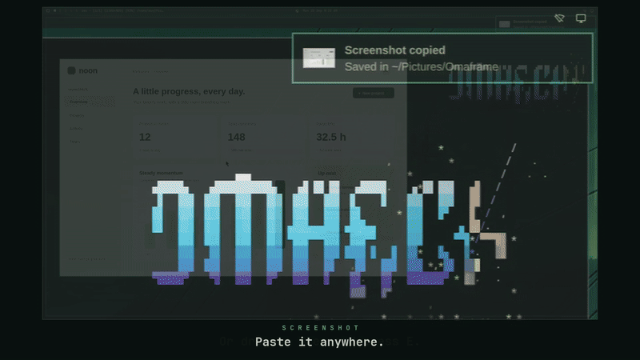
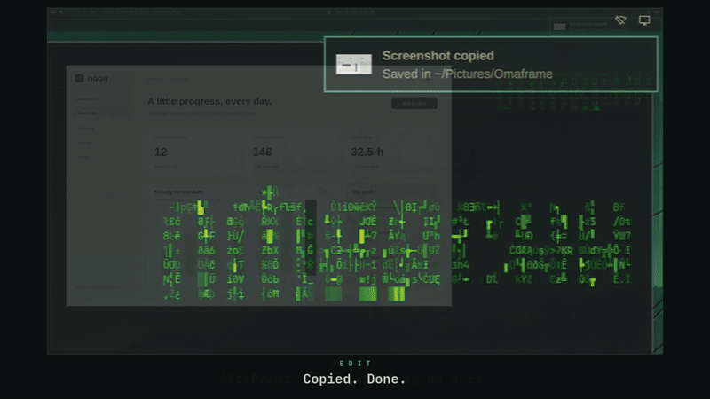

# Omaframe

Beautiful screenshots and clean screen recordings for Omarchy.

Omaframe is small on purpose. Press a key, pick how it looks, paste. When you
need an arrow, a label or a blur, it is one key away. There is no big editor to
learn, no account and no upload. Everything stays on your computer.

<p align="center">
  
</p>

## Install

On Omarchy or Arch with Hyprland, one command installs the latest release and
everything it needs:

```sh
curl -fsSL https://pkgs.btso.dev/install.sh | bash -s -- omaframe
```

It adds my [signed package repository](https://github.com/btsouth/pkgs), so
Omaframe then updates with the rest of your system (`omarchy update` or
`sudo pacman -Syu`). If you installed an earlier release by hand, run the same
command to start getting updates.

If pacman says it cannot satisfy a dependency, your package lists are older
than GPU Screen Recorder 6.1.0. Run `omarchy-update` (or `sudo pacman -Syu` on
plain Arch) and then the command again.

Open Omaframe from the launcher and enable its capture shortcuts. It only
sets up Print, Alt+Print and Alt+Shift+Print when they are free or still use
Omarchy's stock capture actions. It backs up your bindings first and leaves
custom keys alone.

Version 0.9.0 makes a click in the finish chooser select a finish instead of
copying it, and lets Ctrl+C and Ctrl+V copy and paste marks in the editor.
See [the release notes](docs/release-notes-0.9.0.md).

## Take a screenshot

Press Print Screen. Click a window, drag an area, or press F for the whole
display. If the capture bar is in the way, hold Super and drag it, or drag
the grip at its left edge. Press H to hide or restore the bar; each new capture
shows it again. On the finish chooser:

- Click a finish to select it. A single click never copies, saves or closes,
  so a stray click right after a capture is harmless.
- Double-click a finish, press its number, or press Enter to copy the selected
  one. When **Save screenshots automatically** is on, the file is also saved;
  when it is off, only the clipboard gets the capture.
- Press **E** to mark up the selected finish first.
- Press **Ctrl+C** or **Clipboard** to copy the selected finish once without
  saving. Press **Esc** or × to cancel.
- Press **Copy and save** to save the file even when automatic saving is off.

**Save screenshots automatically** is on by default. Turn it off in Settings
to stop keeping screenshot files. This does not disable editable drafts that
are autosaved while you edit. A final clipboard-only copy does not update
the draft with your latest edits.

Paste it anywhere. Crops, marks and redactions you made in the editor are kept
either way. If copying fails, the panel stays open. In the chooser, Ctrl+C
retries a clipboard-only copy; in the editor, use Ctrl+Enter or **Copy**.
A saved screenshot offers a retry for its unfinished step. The close button
still cancels, and Esc while choosing an area still cancels the capture. Clicking outside the panel does nothing.

<p align="center"></p>

While you pick, Omaframe reads the text in the screenshot. If it spots
something that looks like a secret, such as an API key, a token, an email
address or a card number, a **Hide possible secrets** button appears. Press H
and each one gets a redaction you can still move or undo in the editor. It can
miss things, so look before you share. Press T to copy the text in the
screenshot instead. Text copying reads the current crop and edits, so hidden
or cropped-out text is excluded.

## Capture a scrolling page

Press S in the screenshot selector, or run `omaframe --scroll`. Click the window
you want, such as a browser. Omaframe scrolls and stitches the page until it
reaches the end. Move the pointer to take over and scroll by hand if needed.
To keep only part of the page, crop it in the editor afterwards.

Choose Done, Enter or Esc to keep what has been captured. Cancel discards it.
For keyboard controls, point at the progress panel to focus it. The panel sits
outside the capture when there is room; otherwise its rows come from the first
frame, before the panel appeared. Fixed headers and small footers are usually
kept once. Footers taller than about one eighth of the viewport, or 128 pixels,
may repeat.

The result uses the same finishes and editor as an ordinary screenshot. Long
pages fit to width; use Shift+wheel or the scrollbar to reach the bottom while editing.
Capture stops at 32000 pixels along the scrolling direction, 200 MiB of image
pixels, or 400 MiB of retained frame bands. Tiny scroll steps can reach the
frame-band limit first. If it loses track of the page, Omaframe switches to
manual scrolling. A scrollbar is removed when its gutter is verified; window
controls are preserved. Completely repeating content uses wheel cadence and
ranked matches to resolve ambiguous seams, so check the result before sharing. Pages with large animations, overlays
or replaced content may need manual scrolling.

## Mark it up

Press E before you pick a finish. Press T and click to type a label right on
the image, then add arrows, boxes, highlights, blur or redaction, or crop.
Use the mouse wheel to zoom in around the pointer for precise cropping and marks.
With **Select** active, drag empty space to pan the zoomed image. Dragging a mark
still moves it. You can also pan with the middle mouse button or scrollbars. Click **Fit**
to reset the view. Zoom changes only the editor view, not the saved image.
Click an active tool again to return to **Select**. With **Crop**, drag over the
area to keep; the crop applies and returns to Select. Choose Crop again to trim
the cropped image further. **Ctrl+Z** restores each previous crop in turn.
Hold Shift while drawing or dragging an endpoint for 45-degree lines and arrows.
Hold Shift while drawing shapes for squares and circles. Hold Shift while dragging
a shape corner to keep its original proportions.
Drag marks to move them, or hold Shift to move straight. Side handles resize
width or height; text wraps without changing its font size. Drag text corners
to scale the font. Arrow keys move a selected mark one pixel, or ten with Shift.
Pen strokes have resize handles too. Use the contextual
**Style** button to change a tool's appearance. Labels offer text and background colors, opacity,
size and alignment. Arrows offer open or filled heads, color, thickness and a
contrast outline; lines and pen strokes offer the same color, thickness and
outline controls. Boxes and ovals can have a colored fill with opacity.
Highlights offer color and opacity, steps offer circle and number colors and
size, and blur offers strength. Choices are remembered for new marks of each
type. Video annotations use the same controls. Click outside a style panel
to close it. Esc finishes text, cancels a drag, clears the selected mark,
resets the tool to Select, then leaves Edit, one step at a time.

<p align="center"></p>

## Record your screen

Press Alt+Print Screen, then click a window, drag an area, or press F. The Stop
button sits outside what you are recording. If there is no room for it, use
Alt+Print Screen or the Omarchy bar to stop. When you stop, trim the ends or
cut out a slow part, then **Copy and close**. The video is on your clipboard.

If something private showed up while you recorded, press G to blur it or R to
cover it, and drag over it. It stays hidden for the whole clip. To point
something out, pause where it happens and press A for an arrow, B for a box, T
for a label or N for a numbered step. Those show from there to the end. Select
any mark and press I and O to set where it starts and stops.

Version 0.5.0 adds video crop, recovery drafts, camera overlay and GIF export:

- Press C and drag a rectangle to crop the whole clip. Press V to preview it,
  or **Reset crop** to restore the full frame.
- Edits are kept automatically in **Recent edits**, including trim, cuts,
  sound, marks, crop and camera placement. Reopen a draft to continue. Keep
  the original video in place; drafts store edits without copying large videos.
- Turn on **Camera overlay** in recording Options and choose your camera.
  It starts off. After recording, pause playback and drag the camera to move
  it. The **Camera** menu changes its size, position or visibility.
- Use **Export GIF** for a short looping demo or bug report. It includes your
  edits and has no sound, with **Copy GIF** and **Show file** after saving.
  GIFs use up to 720 pixels at 15 fps and clips up to 30 seconds. They can be
  larger than MP4, especially with lots of movement. MP4 export stays available.

Export saves a new MP4 with your edits. **Copy video** copies an opened
original or your current export for pasting into a chat or folder. If a draft
cannot be saved, Omaframe asks before leaving the editor. A failed export
keeps your edits open.

<p align="center"></p>

[Watch the full 50-second demo](https://github.com/btsouth/omaframe/releases/download/v0.2.1/omaframe-demo.mp4)

## Keys

| Where | Key | Does |
| --- | --- | --- |
| Anywhere | Print Screen | Take a screenshot |
| Anywhere | Alt+Print Screen | Start a recording, or stop it |
| Anywhere | Alt+Shift+Print Screen | Pause or resume recording, after enabling capture shortcuts in Settings |
| Choosing an area | F / Tab / Esc | Whole display / switch to video / cancel |
| Choosing an area | H | Hide or restore the capture bar |
| Choosing an area to record | D / M | Computer sound / microphone |
| Picking a finish | Click / double-click | Select a finish / copy it, saving a file when automatic saving is on |
| Picking a finish | 1 to 9, Enter | Copy that finish / the selected one, saving a file when automatic saving is on |
| Picking a finish | Ctrl+C | Copy the selected finish without saving |
| Picking a finish | Esc | Cancel |
| Picking a finish | E / R | Mark up the selected finish / retake |
| Picking a finish | H / T | Hide possible secrets / copy the text |
| Marking up | V C A L B O H R G P N T | Select, crop, arrow, line, box, oval, highlight, redact, blur, pen, steps, text |
| Marking up or video | Shift+drag | Constrain angles, draw squares or circles, keep corner proportions, or move straight |
| Marking up or video | Arrows / Shift+arrows | Move a selected mark one / ten source pixels |
| Marking up | Shift+H | Hide possible secrets |
| Marking up | Ctrl+Z / Ctrl+Shift+Z | Undo / redo |
| Marking up | Delete, Ctrl+D, F2 | Delete, duplicate, rewrite the selected label |
| Marking up | Ctrl+C / Ctrl+X / Ctrl+V | Copy / cut / paste the selected mark. Never copies or closes the screenshot |
| Marking up | Ctrl+Enter | Finish: after a capture, copy and save a file only when automatic saving is on; in the studio, copy and save |
| Reviewing a video | Space, I / O, Delete | Play, set start / end, remove the selected part |
| Reviewing a video | C V G R A B T N | Crop, select, blur, redact, arrow, box, label, step. With a mark selected, I / O set when it shows |
| Reviewing a video | Ctrl+Z / Ctrl+Shift+Z or Ctrl+Y | Undo / redo trim, cuts and marks |
| Reviewing a video | Ctrl+C / Ctrl+X / Ctrl+V, Ctrl+D | Copy / cut / paste the selected mark at the playhead, duplicate it |
| In the window | Ctrl+S | Copy and save, even when automatic saving is off |

## Good to know

Screenshots go to `~/Pictures/Omaframe` and recordings to `~/Videos/Omaframe`.
Change either in Settings. Saved images contain only the rendered pixels, and
redaction replaces pixels with a solid fill. Your originals are never changed.

The text Omaframe reads for H and T stays in memory. It is never saved, not
even in drafts. Reading needs `tesseract` and `tesseract-data-eng`; without
them the button and T are simply not there. Set `OMARCHY_OCR_LANGS` (for
example `eng+deu`) to read other languages, as Omarchy's own text capture does.

Screenshot drafts keep a private copy of the capture. Video drafts keep only
edits and refer to the original video. Both appear under **Recent edits**.
Deleting a video draft leaves the original video and exports in place.
If a screenshot draft cannot be saved, the studio keeps the image and edits
open and offers retry or discard before you leave.

Camera recordings keep a separate camera video and a small `.camera.json`
file beside the screen recording. Keep these files together to edit the camera
later. Pause/resume leaves paused time out of both tracks. If the camera fails,
screen recording continues. Share the exported MP4 to include your chosen layout.

Recording a whole display on a single monitor leaves no room for a Stop button
outside the video, so Omaframe shows a short countdown that tells you how to
stop, and it is gone before the first frame. Stop with Alt+Print Screen or with
the recording icon in the Omarchy bar. With a second monitor, the Stop button
waits there, at the edge next to the one you are recording.

A whole-display recording includes the Omarchy bar, because it is part of the
screen. Stopping from the bar's icon works normally; Omarchy may also show its
own "Screen recording saved" notice.

You can take and edit screenshots while you record. If you stop a recording in
the middle of a screenshot, its review opens once the screenshot is done.

When a capture stops right at a plain background, the finishes carry that
background out a little so the content is not pressed against the edge. Raw
keeps the capture exactly as it was.

Omaframe follows your Omarchy theme and updates when you switch themes.

Pause and Resume sit beside Stop. Pausing keeps the
same recording open and leaves the paused interval out of the saved video
and audio. The timer counts recorded time. You can still take screenshots
while paused, and Stop saves the clip normally.

If the recorder is still finishing 15 seconds after Stop, the button turns
into **Force**. Force-stopping keeps whatever file was written, but it may be
incomplete. If the camera is unplugged before recording starts, the recording
continues screen-only and Omaframe tells you. A selected camera that is not
connected stays selected until you pick another one, so Omaframe never
switches to a different camera on its own.

Enable capture shortcuts in Settings to use **Alt+Shift+Print Screen** for
pause/resume, including whole-display recordings without a visible control.
Setup keeps custom bindings and adds the new key only when it is free.

For scripts or custom keys, use `omaframe --pause-recording`,
`omaframe --resume-recording`, or `omaframe --toggle-recording-pause`. These commands
control only the current Omaframe recording and fail if it is not ready.
Print and Alt+Print keep their existing behavior.

There is no animated zoom yet. Marks on a video stay in place:
they do not follow something that moves or scrolls.

## Uninstall

```sh
sudo pacman -R omaframe
```

Then delete the block between `-- omaframe:shortcuts:start` and
`-- omaframe:shortcuts:end` in `~/.config/hypr/bindings.lua` to give Print
Screen and Alt+Print Screen back to Omarchy and remove the pause shortcut.
Reload Hyprland to apply the change. If cached Lua keeps the running bindings,
restart your Hyprland session. Your screenshots, recordings and settings stay
where they are.

## Build from source

Build dependencies: `base-devel cmake ninja pkgconf qt6-base qt6-declarative
qt6-multimedia qt6-wayland qt6-imageformats bash layer-shell-qt wayland
wayland-protocols wl-clipboard ffmpeg gpu-screen-recorder libpulse procps-ng xdg-utils`.
`libnotify` is optional and adds a notification after a quick screenshot.
`tesseract` and `tesseract-data-eng` are optional and add secret hiding and
copying text.

```sh
cmake -S . -B build -G Ninja -DCMAKE_BUILD_TYPE=RelWithDebInfo
cmake --build build -j 3
./build/omaframe --studio
```

`omaframe` with no options takes a screenshot, `--record` starts or stops a
recording, `--repeat` captures the last area again, `--studio` opens the
window, and a file path opens that image or video. You can also build the
package yourself: download `PKGBUILD` from the
[latest release](https://github.com/btsouth/omaframe/releases/latest) and run
`makepkg -si`. See [RELEASING.md](RELEASING.md) for how releases are made.

The capture, clipboard and recording tests talk to a Wayland compositor and the
session bus, so run them in a throwaway nested desktop rather than your own
session. With [omabox](https://github.com/diogochaves/omabox), for example:

```sh
omabox run --net isolated -- ctest --test-dir build --output-on-failure
```

Test notes and hardware results are in [docs/](docs/), starting with the
[recording validation](docs/recording-validation.md).

GitHub CI builds on Arch and runs eleven headless suites plus OCR pattern tests.
Native capture, clipboard and full OCR recognition checks run locally in omabox. See
[CI coverage](docs/ci.md) and the [current roadmap](docs/release-parity.md).

## License

MIT. The native Wayland capture code is adapted from Omasnap at
`acfb3b5772ccb041b57ccc76e16f1b72719f37e9`, copyright Tobi Lütke, and its
license is kept in [docs/OMASNAP-LICENSE](docs/OMASNAP-LICENSE). MatteShot and
Omaroll informed the workflow and style; Omaframe has its own interface and
renderer.
